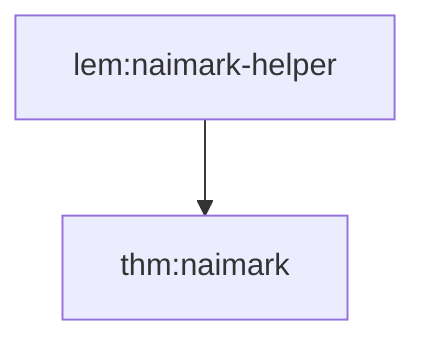
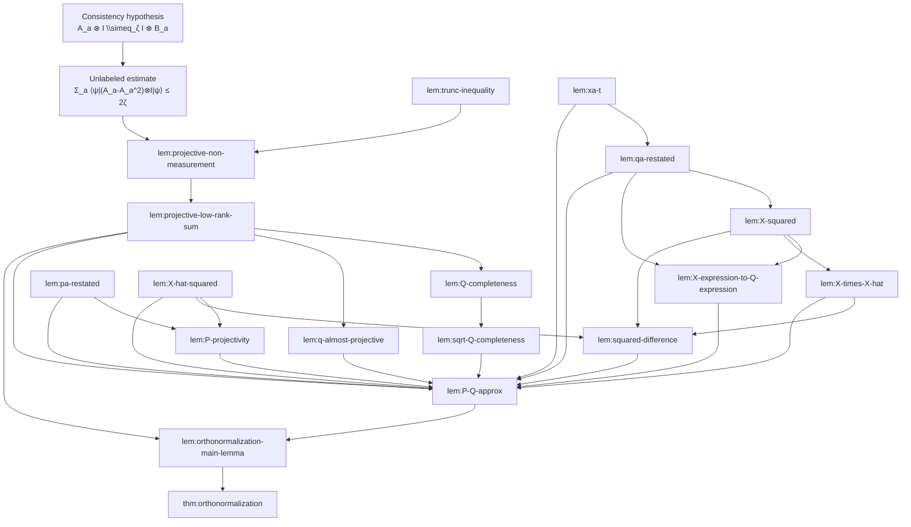

# Gap analysis for Chapter 4 orthonormalization

Date: 2026-04-04

> Update (2026-04-23): the specific blocker tracked by issue #301 is now
> resolved on `main`. The old `Theorems.lean` sites referenced in this report
> were split across `MakingMeasurementsProjective/Projectivization.lean` and
> `MakingMeasurementsProjective/Orthonormalization.lean`, and the current
> declarations `spectralTruncateAlmostProjective` and `orthonormalization`
> both compile cleanly without `sorry`. Treat the detailed status tables below
> as a historical snapshot from 2026-04-04; the remaining live Chapter 4 gap
> is the deeper `Q/X/\widehat X/P` proof spine, not those two wrapper
> declarations.

Files read carefully:

- `references/ldt-paper/orthonormalization.tex`
- `blueprint/src/chapter/ch04_projective.tex`
- `MIPStarRE/LDT/MakingMeasurementsProjective/Defs.lean`
- `MIPStarRE/LDT/MakingMeasurementsProjective/Statements.lean`
- `MIPStarRE/LDT/MakingMeasurementsProjective/Theorems.lean`

## Executive summary

The blueprint compresses this chapter to three labeled results:

- `thm:naimark`
- `lem:orthonormalization-main-lemma`
- `thm:orthonormalization`

The paper uses those three labels too, but the proof of `lem:orthonormalization-main-lemma` is not a black box. It expands into a long internal matrix argument with 16 additional labeled lemmas, plus one extra Naimark helper lemma outside the orthonormalization proof. That is the real chapter gap.

Current Lean coverage only partially reflects this internal structure:

- `lem:naimark-helper` has a direct Lean analogue: `OneMeasNaimarkLemma` in `Statements.lean:32` and `oneMeasNaimark` in `Theorems.lean:67`.
- The orthonormalization proof is currently represented at a much coarser granularity:
  - `consistencyToAlmostProjective` in `Theorems.lean:250`
  - `spectralTruncateAlmostProjective` in `Theorems.lean:265`
  - `adjustTruncatedProjections` in `Theorems.lean:278`
  - `roundAlmostProjMeas` in `Theorems.lean:293`
- There is no explicit Lean layer for the paper's `Q_a`, `Q`, `X_a`, `X`, `T_a`, `\widehat X`, or the `Q -> P` comparison argument.

So the largest gap is not the theorem statement layer. It is the missing proof spine between `orthonormalizationMainLemma` and the current coarse helper packages.

## High-level proof shape in the paper

The paper's proof of `lem:orthonormalization-main-lemma` splits naturally into five stages:

1. Consistency implies almost-projectivity of `A`:
   an unlabeled estimate
   `\sum_a \langle \psi | (A_a - A_a^2) \ot I | \psi \rangle \le 2\zeta`.
2. Spectral truncation:
   `lem:trunc-inequality` and `lem:projective-non-measurement` construct projectors `R_a`.
3. Rank reduction:
   `lem:projective-low-rank-sum` constructs lower-rank projectors `Q_a`.
4. Completeness and almost-projectivity of `Q`:
   `lem:Q-completeness`, `lem:sqrt-Q-completeness`, `lem:q-almost-projective`.
5. SVD/polar-style repair from `Q` to a genuine projective submeasurement `P`:
   `lem:xa-t`, `lem:qa-restated`, `lem:X-squared`,
   `lem:X-expression-to-Q-expression`, `lem:pa-restated`,
   `lem:X-hat-squared`, `lem:X-times-X-hat`,
   `lem:squared-difference`, `lem:P-projectivity`, `lem:P-Q-approx`.

Current Lean only names stages 1, 2, and 5 in a bundled way, and it skips the paper's explicit `Q/X/\widehat X/P` matrix infrastructure.

## Coverage snapshot

| Paper label | Proof role | Lean status | Closest Lean artifact | Difficulty |
| --- | --- | --- | --- | --- |
| `lem:naimark-helper` | one-measurement Naimark | direct | `OneMeasNaimarkLemma`, `oneMeasNaimark` | hard |
| `lem:projective-non-measurement` | spectral truncation to `R_a` | partial | `SpectralTruncationStatement`, `spectralTruncateAlmostProjective` | medium |
| `lem:trunc-inequality` | scalar truncation inequality | partial | `Quantum.SpectralTruncation` witness only | easy |
| `lem:projective-low-rank-sum` | rank reduction `R_a -> Q_a` | none | no direct `Q`-family analogue | hard |
| `lem:Q-completeness` | completeness of `Q` | none | none | medium |
| `lem:sqrt-Q-completeness` | completeness of `\sqrt Q` | none | none | medium |
| `lem:q-almost-projective` | `Q` almost projective | none | none | medium |
| `lem:xa-t` | algebraic identity for `X_a` | none | none | easy |
| `lem:qa-restated` | rewrite `Q_a` via `X,T` | none | none | easy |
| `lem:X-squared` | identify `X X^\dagger` and `X^\dagger X` | none | none | medium |
| `lem:X-expression-to-Q-expression` | convert `X`-expression to `Q`-expression | none | none | medium |
| `lem:pa-restated` | rewrite `P_a` via `\widehat X,T` | none | none | easy |
| `lem:X-hat-squared` | `\widehat X \widehat X^\dagger = I` | none | none | easy |
| `lem:X-times-X-hat` | identify `X^\dagger \widehat X = \sqrt Q` | none | none | medium |
| `lem:squared-difference` | bound `(X-\widehat X)(X-\widehat X)^\dagger` | none | none | medium/hard |
| `lem:P-projectivity` | prove `P` is projective | partial | `RoundedProjMeasStatement`, `adjustTruncatedProjections` | medium |
| `lem:P-Q-approx` | compare `Q` and `P` | partial | bundled into later rounding stage only | hard |

## Dependency DAG

Two connected components matter here: the Naimark helper chain, and the orthonormalization chain.





Notes on the DAG:

- `lem:Q-completeness` also uses the same unlabeled almost-projective estimate `Σ_a ⟨ψ|(A_a-A_a^2)⊗I|ψ⟩ ≤ 2ζ`.
- `lem:X-squared`, `lem:pa-restated`, and `lem:X-hat-squared` also depend on the intervening definitions of `X`, `T`, `\widehat X`, and `P`, but those definitions are not themselves labeled.
- The final step in `lem:orthonormalization-main-lemma` uses triangle inequality together with `lem:projective-low-rank-sum` and `lem:P-Q-approx`.

## Per-label analysis

### `lem:naimark-helper`

Paper statement from `orthonormalization.tex:121-127`:

```latex
\begin{lemma}
  \label{lem:naimark-helper}
  Let $A = \{A_{a}\}$ be a sub-measurement with $k$ distinct outcomes $a \in \calA$, and let $\ket{\mathsf{aux}} \in \C^{k+1}$ be any state. Then there exists a projective sub-measurement $\widehat{A} = \{\widehat{A}_{a}\}$ such that
  for each outcome~$a$,
  \[ (I \ot \bra{\mathsf{aux}} ) \cdot \widehat{A}_{a} \cdot (I \ot \ket{\mathsf{aux}}) =
    A_{a}. \]
\end{lemma}
```

- Uses: no earlier labeled lemma; the proof uses matrix square roots and a unitary extension.
- Used by: `thm:naimark`.
- Lean correspondence: direct. This is essentially `OneMeasNaimarkLemma` (`Statements.lean:32`) proved by `oneMeasNaimark` (`Theorems.lean:67`), though the Lean packaging is stronger and uses expectation preservation rather than only the compression identity.
- Difficulty: hard. The proof needs `CFC.sqrt`, positivity of the remainder, unitary completion, and tensor/Kronecker bookkeeping.

### `lem:projective-non-measurement`

Paper statement from `orthonormalization.tex:414-423`:

```latex
\begin{lemma}[Rounding to projectors]\label{lem:projective-non-measurement}
There exists a set of projective matrices $\{R_a\}$ such that
\begin{equation*}
A_a \ot I \approx_{2\sqrt{\zeta}} R_a \ot I.
\end{equation*}
and
\begin{equation*}
R:= \sum_a R_a \leq (1+2\sqrt{\zeta}) \cdot I.
\end{equation*}
\end{lemma}
```

- Uses: the unlabeled almost-projective estimate `Σ_a ⟨ψ|(A_a-A_a^2)⊗I|ψ⟩ ≤ 2ζ`, plus `lem:trunc-inequality`.
- Used by: `lem:projective-low-rank-sum`.
- Lean correspondence: partial. The closest analogue is the spectral-truncation layer:
  - `SpectralTruncationStatement` (`Statements.lean:115`)
  - `MatrixSpectralTruncationMeasurementWitness` (`Defs.lean:366`)
  - `spectralTruncateAlmostProjective` (`Theorems.lean:265`)
  But the paper's extra global estimate `R \le (1+2\sqrt{\zeta})I` is not part of the current Lean statement.
- Difficulty: medium. The per-outcome truncation is standard once spectral truncation is available, but the global sum bound must also be tracked.

### `lem:trunc-inequality`

Paper statement from `orthonormalization.tex:447-452`:

```latex
\begin{lemma}\label{lem:trunc-inequality}
For any $x \in [0, 1]$,
\begin{equation*}
(x - \mathsf{trunc}_\delta(x))^2 \leq \frac{1}{\delta} \cdot (x - x^2).
\end{equation*}
\end{lemma}
```

- Uses: none beyond the definition of `\mathsf{trunc}_\delta`.
- Used by: `lem:projective-non-measurement`.
- Lean correspondence: partial only. There is a generic `Quantum.SpectralTruncation` witness in `Quantum/FiniteMatrix.lean:176`, but no named scalar lemma with a free parameter `\delta`, and the current abstraction bakes in threshold-based truncation instead of this exact scalar inequality.
- Difficulty: easy. This is a scalar case split on `x \ge 1-\delta`.

### `lem:projective-low-rank-sum`

Paper statement from `orthonormalization.tex:540-553`:

```latex
\begin{lemma}[Rank reduction]\label{lem:projective-low-rank-sum}
There exists a set of projection matrices $\{Q_a\}$ such that
\begin{equation*}
A_a \ot I \approx_{12\sqrt{\zeta}} Q_a \ot I.
\end{equation*}
and
\begin{equation*}
Q:= \sum_a Q_a \leq (1+2\sqrt{\zeta}) \cdot I.
\end{equation*}
Furthermore,  $Q$ has bounded total rank:
\begin{equation*}
\sum_a \mathrm{rank}(Q_a) \leq d.
\end{equation*}
\end{lemma}
```

- Uses: `lem:projective-non-measurement` and triangle inequality for `\approx_\delta`.
- Used by: `lem:Q-completeness`, `lem:q-almost-projective`, and the final triangle-inequality step in `lem:orthonormalization-main-lemma`.
- Lean correspondence: none directly. Current Lean has no explicit `Q_a` family, no rank-selection step, and no statement recording bounded total rank. The nearest later-stage abstraction is `adjustTruncatedProjections` (`Theorems.lean:278`), but that skips this construction entirely.
- Difficulty: hard. Formalizing “keep the `d` largest overlaps” and the tie-breaking/rank bookkeeping is substantially more combinatorial than the earlier truncation step.

### `lem:Q-completeness`

Paper statement from `orthonormalization.tex:665-670`:

```latex
\begin{lemma}[Completeness of~$Q$]\label{lem:Q-completeness}
\begin{equation*}
\bra{\psi} Q \otimes I \ket{\psi}
\geq 1 - 11 \zeta^{1/4}.
\end{equation*}
\end{lemma}
```

- Uses: `lem:projective-low-rank-sum` and the unlabeled almost-projective estimate `Σ_a ⟨ψ|(A_a-A_a^2)⊗I|ψ⟩ ≤ 2ζ`.
- Used by: `lem:sqrt-Q-completeness`.
- Lean correspondence: none. There is no explicit completeness lemma for an intermediate `Q`.
- Difficulty: medium. The argument is mostly Cauchy-Schwarz and error bookkeeping, but it depends on the not-yet-formalized `Q_a` layer.

### `lem:sqrt-Q-completeness`

Paper statement from `orthonormalization.tex:716-721`:

```latex
\begin{lemma}[Completeness of~$\sqrt{Q}$]\label{lem:sqrt-Q-completeness}
\begin{equation*}
\bra{\psi} \sqrt{Q} \otimes I \ket{\psi}
\geq 1 - 12 \zeta^{1/4}.
\end{equation*}
\end{lemma}
```

- Uses: `lem:Q-completeness` and spectral calculus for `\sqrt Q`.
- Used by: `lem:P-Q-approx`.
- Lean correspondence: none. There is no explicit `\sqrt Q` layer in the current formalization.
- Difficulty: medium. The main proof burden is operator monotonicity and comparing `\sqrt Q` to `Q` under the bound `Q \le (1+2\sqrt\zeta)I`.

### `lem:q-almost-projective`

Paper statement from `orthonormalization.tex:755-759`:

```latex
\begin{lemma}[$Q$ is almost projective]\label{lem:q-almost-projective}
\begin{equation*}
\sum_a (Q_a \cdot Q  \cdot Q_a - Q_a) \leq  4\sqrt{\zeta} \cdot I.
\end{equation*}
\end{lemma}
```

- Uses: `lem:projective-low-rank-sum`.
- Used by: `lem:P-Q-approx`, via `lem:X-expression-to-Q-expression`.
- Lean correspondence: none. `MatrixAlmostProjectiveWitness` in `Defs.lean:320` is about almost-projectivity of the original measurement `A`, not of the derived `Q`.
- Difficulty: medium. The argument itself is short, but it requires the explicit `Q_a`/`Q` layer.

### `lem:xa-t`

Paper statement from `orthonormalization.tex:800-804`:

```latex
\begin{lemma}\label{lem:xa-t}
For each~$a$, $\displaystyle
X_a = T_a \cdot X.
$
\end{lemma}
```

- Uses: only the preceding definitions of `X_a`, `X`, and `T_a`.
- Used by: `lem:qa-restated` and `lem:P-Q-approx`.
- Lean correspondence: none. No Lean definitions for `X_a`, `X`, or `T_a` currently exist.
- Difficulty: easy. This is direct finite-sum algebra once the objects exist.

### `lem:qa-restated`

Paper statement from `orthonormalization.tex:813-818`:

```latex
\begin{lemma}[$Q_a$ restated]\label{lem:qa-restated}
For each~$a$,
\begin{equation*}
Q_a = X^\dagger_a \cdot X_a = X^\dagger \cdot T_a \cdot X = X_a^\dagger \cdot X.
\end{equation*}
\end{lemma}
```

- Uses: `lem:xa-t` and the fact that `T` is projective.
- Used by: `lem:X-squared`, `lem:X-expression-to-Q-expression`, and `lem:P-Q-approx`.
- Lean correspondence: none.
- Difficulty: easy. This is a basic rewrite lemma, but it depends on introducing the missing matrix-decomposition layer.

### `lem:X-squared`

Paper statement from `orthonormalization.tex:862-870`:

```latex
\begin{lemma}[$X$ squared]\label{lem:X-squared}
\begin{equation*}
X \cdot X^\dagger = U  \cdot (\Sigma_{m \times m})^2 \cdot U^\dagger,
\quad
\text{and}
\quad
X^\dagger \cdot X = Q = V \cdot (\Sigma_{d \times d})^2 \cdot V^\dagger.
\end{equation*}
\end{lemma}
```

- Uses: `lem:qa-restated` and the SVD definition of `X`.
- Used by: `lem:X-expression-to-Q-expression`, `lem:X-times-X-hat`, and `lem:squared-difference`.
- Lean correspondence: none. There is no explicit SVD layer in current Lean.
- Difficulty: medium. The algebra is standard, but formalizing SVD-style bookkeeping is a significant prerequisite.

### `lem:X-expression-to-Q-expression`

Paper statement from `orthonormalization.tex:901-907`:

```latex
\begin{lemma}\label{lem:X-expression-to-Q-expression}
For each~$a$,
\begin{equation*}
X_a^\dagger \cdot (X \cdot X^\dagger - I_{m \times m})^2 \cdot X_a
= Q_a \cdot Q \cdot Q_a - Q_a.
\end{equation*}
\end{lemma}
```

- Uses: `lem:X-squared` and `lem:qa-restated`.
- Used by: `lem:P-Q-approx`.
- Lean correspondence: none.
- Difficulty: medium. It is a contained algebraic identity, but it sits on top of the missing `X/Q` infrastructure.

### `lem:pa-restated`

Paper statement from `orthonormalization.tex:968-973`:

```latex
\begin{lemma}[$P_a$ restated]\label{lem:pa-restated}
For each~$a$,
\begin{equation*}
P_a = \widehat{X}^\dagger \cdot T_a \cdot \widehat{X} = \widehat{X}_a^\dagger \cdot \widehat{X}.
\end{equation*}
\end{lemma}
```

- Uses: only the definitions of `\widehat X`, `\widehat X_a`, `P_a`, and projectivity of `T`.
- Used by: `lem:P-projectivity` and `lem:P-Q-approx`.
- Lean correspondence: none.
- Difficulty: easy.

### `lem:X-hat-squared`

Paper statement from `orthonormalization.tex:984-988`:

```latex
\begin{lemma}[$\widehat{X}$ squared]\label{lem:X-hat-squared}
\begin{equation*}
\widehat{X} \cdot \widehat{X}^\dagger = I_{m \times m}.
\end{equation*}
\end{lemma}
```

- Uses: the definition `\widehat X = U I_{m\times d} V^\dagger` and the unitarity of `U,V`.
- Used by: `lem:squared-difference`, `lem:P-projectivity`, and `lem:P-Q-approx`.
- Lean correspondence: none.
- Difficulty: easy. Once the rectangular-identity notation is set up, this is straightforward matrix multiplication.

### `lem:X-times-X-hat`

Paper statement from `orthonormalization.tex:1005-1013`:

```latex
\begin{lemma}[$X$ times $\widehat{X}$]\label{lem:X-times-X-hat}
\begin{equation*}
X \cdot \widehat{X}^\dagger = U  \cdot \Sigma_{m \times m} \cdot U^\dagger,
\quad
\text{and}
\quad
X^\dagger \cdot \widehat{X} = \sqrt{Q}.
\end{equation*}
\end{lemma}
```

- Uses: the SVD definition and `lem:X-squared`.
- Used by: `lem:squared-difference` and `lem:P-Q-approx`.
- Lean correspondence: none.
- Difficulty: medium. The second identity is the nontrivial one because it identifies a concrete SVD expression with `\sqrt Q`.

### `lem:squared-difference`

Paper statement from `orthonormalization.tex:1036-1040`:

```latex
\begin{lemma}[Squared difference]\label{lem:squared-difference}
\begin{equation*}
(X - \widehat{X}) \cdot (X - \widehat{X})^\dagger \leq (X \cdot X^\dagger - I_{m \times m})^2.
\end{equation*}
\end{lemma}
```

- Uses: `lem:X-squared`, `lem:X-hat-squared`, and `lem:X-times-X-hat`.
- Used by: `lem:P-Q-approx`.
- Lean correspondence: none.
- Difficulty: medium/hard. The key operator inequality is easy on diagonal matrices but still needs clean transport through conjugation by `U`.

### `lem:P-projectivity`

Paper statement from `orthonormalization.tex:1069-1071`:

```latex
\begin{lemma}[Projectivity of~$P$]\label{lem:P-projectivity}
$P = \{P_a\}$ forms a projective sub-measurement.
\end{lemma}
```

- Uses: `lem:pa-restated` and `lem:X-hat-squared`.
- Used by: `lem:P-Q-approx`.
- Lean correspondence: partial. The eventual Lean target is exactly a `ProjSubMeas`:
  - `RoundedProjMeasStatement` (`Statements.lean:123`)
  - `adjustTruncatedProjections` (`Theorems.lean:278`)
  But Lean currently has no internal theorem showing projectivity from the paper's `\widehat X/T` construction.
- Difficulty: medium. The calculation is short, but only after the missing `\widehat X/T/P` layer is in place.

### `lem:P-Q-approx`

Paper statement from `orthonormalization.tex:1089-1093`:

```latex
\begin{lemma}[$P$ is close to~$Q$]\label{lem:P-Q-approx}
\begin{equation*}
Q_a \otimes I \approx_{30\zeta^{1/4}} P_a \otimes I.
\end{equation*}
\end{lemma}
```

- Uses: `lem:projective-low-rank-sum`, `lem:q-almost-projective`, `lem:sqrt-Q-completeness`, `lem:xa-t`, `lem:qa-restated`, `lem:X-expression-to-Q-expression`, `lem:pa-restated`, `lem:X-hat-squared`, `lem:X-times-X-hat`, `lem:squared-difference`, and `lem:P-projectivity`.
- Used by: the final triangle-inequality step in `lem:orthonormalization-main-lemma`.
- Lean correspondence: partial only. The current Lean rounding layer
  - `adjustTruncatedProjections` (`Theorems.lean:278`)
  - `roundAlmostProjMeas` (`Theorems.lean:293`)
  - `RoundedProjMeasStatement` (`Statements.lean:123`)
  packages an eventual `A -> P` closeness result, but there is no explicit intermediate `Q -> P` lemma and no supporting `Q/X/\widehat X` infrastructure.
- Difficulty: hard. This is the main bookkeeping-heavy lemma of the whole orthonormalization proof.

## Main conclusions for a Lean formalization plan

- The paper-proof gap is real and structural. A faithful Lean port of `lem:orthonormalization-main-lemma` will likely need at least one new internal layer between the current coarse helper lemmas and the final statement.
- The cleanest missing abstraction boundary is the paper's `Q/X/\widehat X/P` layer. Without it, the current Lean proof plan has no place to express the paper's actual late-stage argument.
- If the project chooses not to formalize the paper proof literally, it will need a genuinely different argument for `adjustTruncatedProjections`. Right now the existing Lean statements hint at such a compression, but the paper does not justify it directly.
- The one obvious direct missing statement already present in Lean is `lem:naimark-helper`; the orthonormalization internals are where the blueprint-to-paper compression is most severe.
